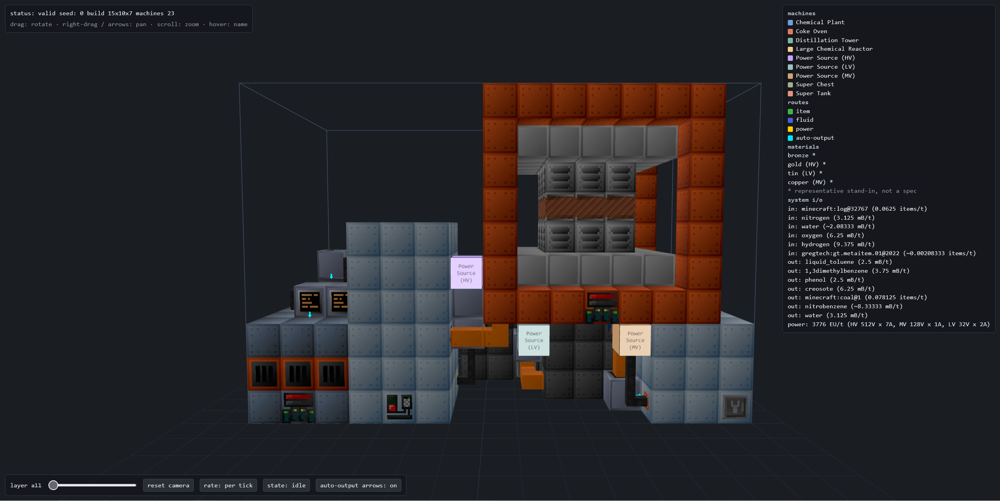

# gtnh_solver

**Physical place-and-route solver for GregTech: New Horizons process lines.**

> **Status: Phase 1 shipped end to end; Phase 2 quality work is landing.** A real
> gtnh-factory-flow export goes all the way to a validated, buildable layout: adapter, physical
> dataset, annealed placement, per-commodity routing, shared-amperage power, hatch placement, the
> independent validator, a 3D previewer and a build guide. Machines place at their real multiblock
> footprints, every routed connection lands on a casing cell as the GT hatch it would actually be,
> and the previewer draws each block with its in-game texture.
>
> **The generated dataset is deliberately local-only.** The Java extractor
> (`tools/gtnh-extractor/`) regenerates the multiblock dump and the texture manifest on demand into
> gitignored `data/<version>/` folders, so several pack versions can sit side by side; the repo
> ships two multiblock fixtures plus a small example-scoped texture manifest, so a fresh clone
> still solves and renders without running anything.
>
> Still ahead: the multi-channel realizability invariant, power optimization beyond
> size-or-reject, the anytime wall-clock budget, and pipe/cable textures. See
> [`docs/ROADMAP.md`](docs/ROADMAP.md) and [`CHANGELOG.md`](CHANGELOG.md).

If you see any areas in the code or documentation that can be improved, feel free to contribute
and make issues or PR's!

**Input comes from [gtnh-factory-flow](https://github.com/Samiracle64/gtnh-factory-flow)** (MIT):
you design and balance a production line there, export it as plan JSON, and `gtnh_solver` turns
that into a physical, buildable layout.



*The `--preview` viewer on `examples/gtnh-nitrobenzene.json`: 23 machines in a 17x10x8 build,
with the shared-amperage power net and the per-tick system I/O the line consumes and produces.*

## How it works (data flow)

```
   gtnh-factory-flow (exported plan JSON) ──adapter──► IR ◄── physical-rules dataset
                                             │    (footprints, hatch slots, tiers, ME)
                                             ▼
                        placement (SA/LNS) ◄─routing-aware cost─► router (A*, 3D,
                                  │            + feedback loop     per-commodity, power)
                                  └──────────────┬─────────────────┘
                                                 ▼
                                     hatch placement (each connection
                                     takes a casing cell and a facing)
                                                 ▼
                                           validator (independent checks)
                                          ┌──────┴──────┐
                                          ▼             ▼
                                     previewer      build guide
                                  (three.js, real    (BoM, layers)
                                   GT textures)
```

## Quickstart

Needs **Python 3.10+** (`pyproject.toml` sets `requires-python = ">=3.10"`; an older default
`python` makes `pip install` fail opaquely). Work inside a virtual env:

```bash
python -m venv .venv && . .venv/bin/activate   # Windows: py -3.12 -m venv .venv; .venv\Scripts\activate
pip install -e ".[dev]"
gtnh-solve examples/gtnh-sand.json        # solve a gtnh-factory-flow export, print the build guide
gtnh-solve plan.json -o guide.txt         # ...or write the guide to a file
gtnh-solve plan.json --preview view.html  # ...or a double-clickable 3D preview (three.js)
gtnh-solve plan.json --fast               # skip optimization: a near-instant constructive layout
gtnh-solve plan.json --seed 3             # pick the solver seed (deterministic per seed)
gtnh-solve plan.json --objective volume   # what "compact" means: footprint|volume|balanced
gtnh-solve plan.json --dataset-version 2.8.4   # pin a locally generated data/<version>/ dump
gtnh-solve --list-dataset-versions             # ...or see which ones you have
```

See [`CONTRIBUTING.md`](CONTRIBUTING.md#setup) for the full dev setup (hooks, tests, lint).

Exit code: 0 when the layout is fully valid, 1 when the solver can only return an explicit
infeasibility (the reason prints to stderr), 2 when the export can't be loaded. The `--preview`
three.js viewer is built; a congestion heatmap, multi-seed compare, and offline (vendored)
three.js are Phase 2 (see the roadmap).

## Documentation

| Doc | What's in it |
|-----|--------------|
| [`docs/DESIGN.md`](docs/DESIGN.md) | Problem, premises, chosen approach |
| [`docs/ARCHITECTURE.md`](docs/ARCHITECTURE.md) | Components, data flow, engineering decisions |
| [`docs/IR.md`](docs/IR.md) | The IR + output-layout contracts |
| [`docs/DOMAIN.md`](docs/DOMAIN.md) | GT:NH rules the solver encodes |
| [`docs/ROADMAP.md`](docs/ROADMAP.md) | v1 scope, deferrals, milestones, parallel lanes |
| [`docs/TESTING.md`](docs/TESTING.md) | Test strategy and ground-truth approach |
| [`docs/dataset-extraction/`](docs/dataset-extraction/) | How the physical dataset and textures are extracted from GT5-Unofficial |

[`docs/README.md`](docs/README.md) is the full index, with a one-line summary of every file.

## Contributing

New here? Read [`CONTRIBUTING.md`](CONTRIBUTING.md) - its **Build lanes** table maps the
Phase 2 workstreams with a status for each, so you can pick an actionable piece and start.
Phase 1 already built a crude end-to-end version of the whole pipeline; the lanes are the
quality upgrades on top of it (deeper phase context in [`docs/ROADMAP.md`](docs/ROADMAP.md)).

## License

Apache-2.0. See [`LICENSE`](LICENSE) and [`NOTICE`](NOTICE). Consumes plan/recipe JSON
exported by the MIT-licensed [`gtnh-factory-flow`](https://github.com/Samiracle64/gtnh-factory-flow);
no third-party code is vendored.
